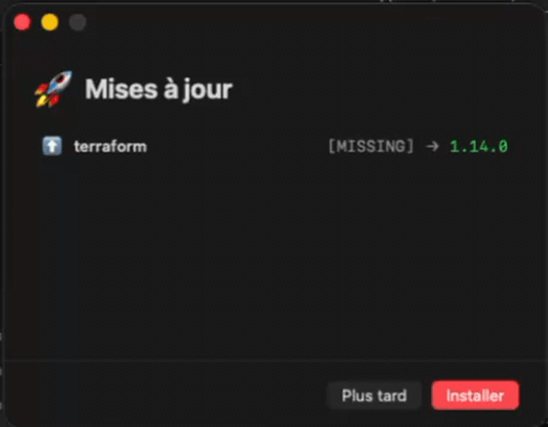

# macOS Mise & Homebrew Update Notification

Native macOS notifications when [mise](https://mise.jdx.dev/) or [Homebrew](https://brew.sh/) packages have updates available.



## Features

- **Dual package manager support**: mise + Homebrew
- **Native notifications** via `terminal-notifier`
- **Native SwiftUI app** for viewing and installing updates (single window, smooth transitions)
- **Real-time progress** during installation
- **Smart caching** to avoid duplicate notifications
- **Automatic scheduling** via launchd (hourly + on login)

## Requirements

- macOS 13+
- [terminal-notifier](https://github.com/julienXX/terminal-notifier) - `brew install terminal-notifier`
- At least one of:
  - [mise](https://mise.jdx.dev/) - polyglot runtime manager
  - [Homebrew](https://brew.sh/) - package manager for macOS

## Installation

### 1. Clone the repository

```bash
git clone git@github.com:m4dm4rtig4n/mise-notification-update.git
cd mise-notification-update
```

### 2. Build and install

```bash
# Build the SwiftUI app
cd MiseUpdater
swift build -c release
cd ..

# Copy files to ~/Bin
mkdir -p ~/Bin
cp mise-update-notifier.sh ~/Bin/
cp -R MiseUpdater.app ~/Bin/
chmod +x ~/Bin/mise-update-notifier.sh
```

Or use the install script:

```bash
./install.sh
```

### 3. Configure launchd (automatic updates check)

```bash
# Copy the plist
cp com.mise.update-notifier.plist ~/Library/LaunchAgents/

# Load the service
launchctl load ~/Library/LaunchAgents/com.mise.update-notifier.plist
```

## Usage

### Manual check

```bash
# Check for updates and show notification
~/Bin/mise-update-notifier.sh

# Open updater app directly
open ~/Bin/MiseUpdater.app
```

### Manage the service

```bash
# Check status
launchctl list | grep mise

# Stop the service
launchctl unload ~/Library/LaunchAgents/com.mise.update-notifier.plist

# Start the service
launchctl load ~/Library/LaunchAgents/com.mise.update-notifier.plist

# View logs
tail -f ~/.cache/mise-notifier.log
```

## Configuration

### Environment variables

| Variable | Default | Description |
|----------|---------|-------------|
| `MISE_BIN` | `~/.local/bin/mise` | Path to mise binary |
| `BREW_BIN` | `/opt/homebrew/bin/brew` | Path to Homebrew binary |
| `CACHE_FILE` | `~/.cache/mise-notifier-last` | Cache file for dedup |
| `DIALOG_APP` | `~/Bin/MiseUpdater.app` | Path to updater app |

### launchd schedule

Default: runs at login + every hour. Edit `StartInterval` in the plist:

```xml
<key>StartInterval</key>
<integer>3600</integer>  <!-- seconds (3600 = 1 hour) -->
```

## How it works

```
┌─────────────────────┐
│  launchd (hourly)   │
└──────────┬──────────┘
           │
           ▼
┌─────────────────────┐     no updates     ┌─────────────────┐
│ mise-update-notifier│ ─────────────────▶ │   (silent)      │
│   (mise + brew)     │                    └─────────────────┘
└──────────┬──────────┘
           │ updates found
           ▼
┌─────────────────────┐
│    Notification     │
│  "🔄 5 updates"     │
└──────────┬──────────┘
           │ click
           ▼
┌─────────────────────────────────────┐
│         MiseUpdater.app             │
│  ┌───────────────────────────────┐  │
│  │ 🚀 Mises à jour               │  │
│  │                               │  │
│  │ 🔧 node    20.10.0 → 22.0.0  │  │
│  │ 🔧 helm    3.14.0  → 3.15.0  │  │
│  │ 🍺 git     2.43.0  → 2.44.0  │  │
│  │ 🍺 jq      1.7.0   → 1.7.1   │  │
│  │                               │  │
│  │    [Plus tard]  [Installer]   │  │
│  └───────────────────────────────┘  │
│                 │                   │
│                 ▼ click Install     │
│  ┌───────────────────────────────┐  │
│  │ ⏳ Installation...            │  │
│  │ ▸ 🔧 Mise à jour mise...      │  │
│  │ ▸ 🍺 Mise à jour Homebrew...  │  │
│  │ ████████████░░░░░░ 60%        │  │
│  └───────────────────────────────┘  │
│                 │                   │
│                 ▼ done              │
│  ┌───────────────────────────────┐  │
│  │ ✅ Terminé !                  │  │
│  │ ▸ ✅ Terminé!                 │  │
│  │ ████████████████████ 100%     │  │
│  │              [OK]             │  │
│  └───────────────────────────────┘  │
└─────────────────────────────────────┘
        (same window throughout)
```

## Files

| File | Description |
|------|-------------|
| `mise-update-notifier.sh` | Main script, checks mise + brew and sends notification |
| `MiseUpdater/` | SwiftUI source code |
| `MiseUpdater.app/` | Compiled macOS app (handles both mise and Homebrew) |
| `com.mise.update-notifier.plist` | launchd service definition |

## Building from source

```bash
cd MiseUpdater
swift build -c release
cp .build/release/MiseUpdater ../MiseUpdater.app/Contents/MacOS/
```

## License

MIT
